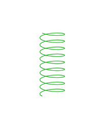
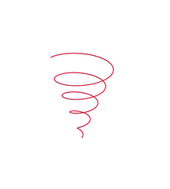
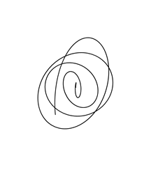

### id0jam

*The Theory of Everything*   

A spatial geometric curve   
Powered by [3D Calculator - GeoGebra](https://www.geogebra.org/3d "3D Calculator")
   
   
**i=t(θ; jθ; kθ)**   
**d=s(asinθ, bcosθ, cθ)**   
**0<θ<nπ**   

__*j(1; θ; 2θ)*__   
__*a(sinθ; cosθ; θ)*__   
__*m(cosθ; sinθ; θ)*__   

### [Boson](https://www.geogebra.org/3d/gcn57kyu)  
| code   | id |  
| :-- | :-- |
| g(sinθ, cosθ, nθ)  |       Gravitational Force | 
|  s(θ; θ; nπ)   |           Strong Nuclear Force|
|  t(θ; θ) |                  Ether Force| 
|  w(θ; θ; θ/n)      |        Weak Nuclear Force | 
|  e(θ; θ/n; θ)     |         Electromagnetic Force | 

### [Fermion](https://www.geogebra.org/3d/zzkwnbrc)
| code   | id |  ray|
| :-- | :-- |:-- |
|a(1; θ; 2θ)          |    atom    |   Alpha rays|
|p(sinθ; cosθ; θ)      |   proton||
|e(sinθ; θ; cosθ)      |   electron||
|n(cosθ; sinθ; θ)     |    neutron||
|v(cosθ; θ; sinθ)      |   neutrino||
|β(θ; sinθ; cosθ)    |           |     Beta rays+|
|β(θ; cosθ; sinθ)      |         |     Beta rays-|
|γ(θ; θ; 2θ)          |           |    Gamma rays|      
   

### g(sinθ, cosθ, nθ) --- Gravitational Force
     
### s(θ; θ; nπ)  --- Strong Nuclear Force
     
### w(θ; θ; θ/n)  ---  Weak Nuclear Force 
      
###  e(θ; θ/n; θ) ---  Electromagnetic Force
    

